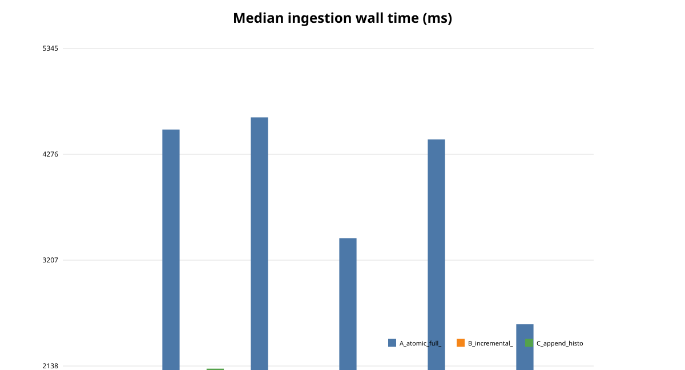
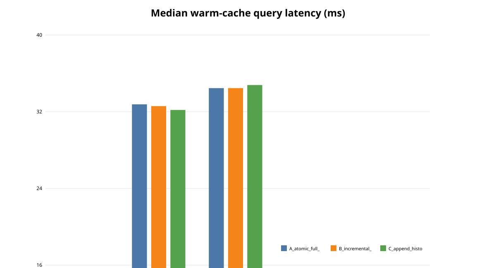
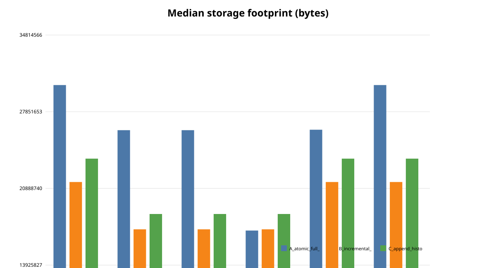
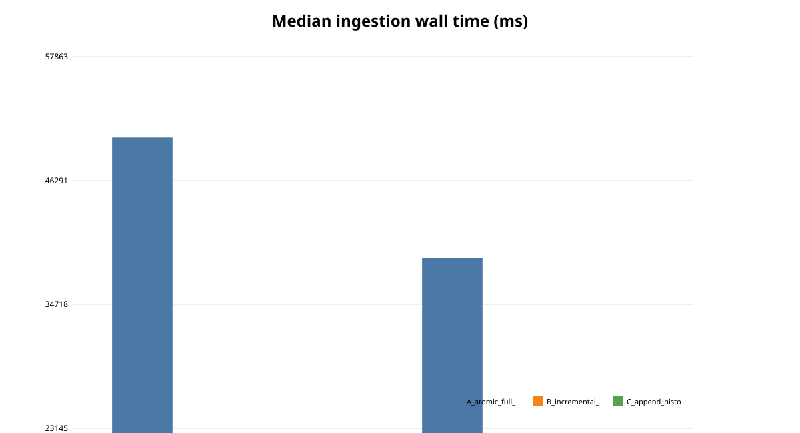
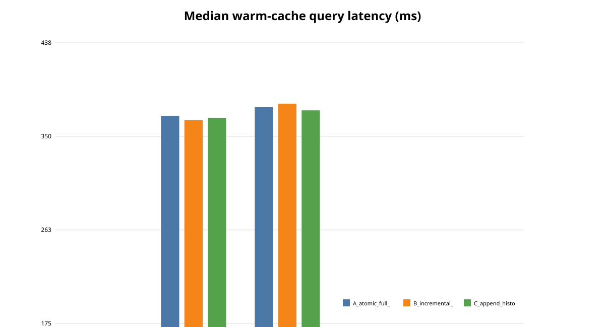
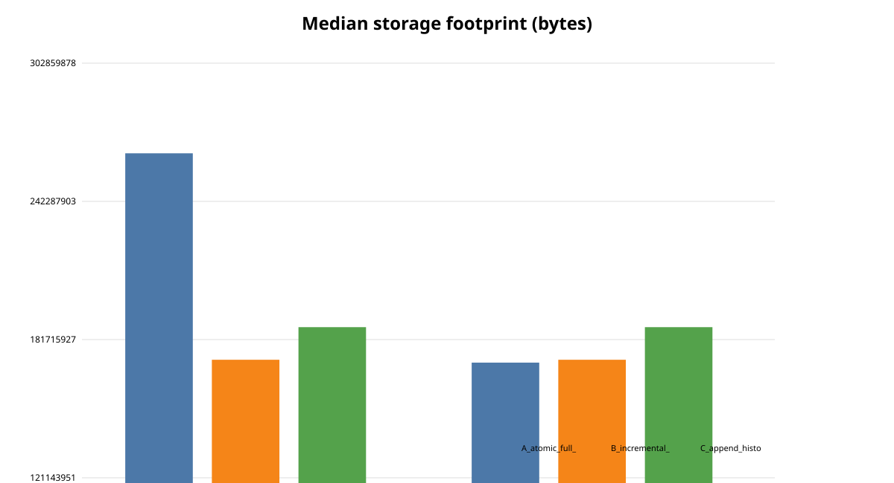

# Finance Data Pipelines

[](https://github.com/SoheilGtex/finance-data-pipelines/actions/workflows/ci.yml)

A correctness-first, reproducible time-series ETL and SQLite benchmark for comparing three loading strategies under stateful updates, duplicates, conflicts, stale revisions, and interruption recovery.

## Why this project exists

The project studies a practical systems question:

> How do different SQLite loading strategies behave when they must preserve the same logical state under reruns, updates, duplicates, stale revisions, conflicts, and failures?

The benchmark compares:

- **Strategy A — Atomic full replacement**
- **Strategy B — Transactional incremental upsert**
- **Strategy C — Append-only history with a materialized current-state projection**

All three strategies are validated against the same independent logical-state oracle before performance results are summarized.

## Highlights

- Deterministic synthetic time-series generator
- Strict normalization and revision semantics
- Independent logical-state oracle with stable SHA-256 checksums
- Stateful workload execution
- Cross-batch same-revision conflict rejection
- Stale-revision protection
- Process-interruption and transactional recovery tests
- Five fixed query workloads with warm-up and timed samples
- Reproducible 100k and 1m benchmark cohorts
- GitHub Actions validation on Python 3.11 and 3.12

## Benchmark results

Median initial-load wall time from the corrected Phase 3E analysis:

| Cohort | Strategy A | Strategy B | Strategy C |
|---|---:|---:|---:|
| 100k rows | 3,429.25 ms | 1,733.58 ms | 1,868.53 ms |
| 1m rows | 39,050.38 ms | 21,173.67 ms | 22,539.42 ms |

For the recorded environment and workloads:

- At **100k rows**, Strategy B had **49.4% lower** median initial-load wall time than Strategy A.
- At **1m rows**, Strategy B had **45.8% lower** median initial-load wall time than Strategy A.
- At **1m rows**, Strategy A took about **1.84×** as long as Strategy B.

These are cohort-specific observations, not universal performance claims.

### 100k cohort







### 1m cohort







See the corrected execution report:

[`docs/phase3e/phase3e-final-execution-report-corrected.md`](docs/phase3e/phase3e-final-execution-report-corrected.md)

## Requirements

- Python 3.11 or newer
- SQLite supplied by Python
- No API key or network data source required

## Installation

```bash
python3 -m venv .venv
source .venv/bin/activate
python -m pip install --upgrade pip
python -m pip install .
fdp --help
```

For development:

```bash
python -m pip install -e '.[dev]'
```

`pyproject.toml` is the authoritative dependency definition. `requirements*.txt` are compatibility wrappers only.

## Deterministic offline quickstart

Choose the output directory explicitly:

```bash
fdp run-all \
  --source synthetic \
  --seed 20270916 \
  --rows 1000 \
  --output-dir /tmp/fdp-run
```

The command performs two identical atomic full replacements so exact-rerun idempotency is verified.

It writes:

```text
/tmp/fdp-run/
  raw/prices_raw.parquet
  normalized/prices_normalized.parquet
  dataset_manifest.json
  correctness.json
  warehouse.db
```

The quickstart produces correctness evidence only. Comparative benchmark results are generated separately.

## Controlled experiment

The benchmark harness is:

```text
scripts/benchmark.py
```

It:

- freezes SQLite WAL and `synchronous=FULL`
- uses one fresh database per strategy and repetition
- rotates strategy order
- validates every accepted state against the independent oracle
- records environment and dataset metadata
- records state transitions and recovery evidence
- benchmarks five fixed query workloads
- regenerates analysis from raw files only

A small offline smoke run is available with:

```bash
make benchmark-small
```

Analysis is regenerated with:

```bash
python scripts/analyze_benchmark.py <raw_dir> <output_dir>
```

The full benchmark is intentionally separate from ordinary CI.

## Stateful semantics

The logical key is:

```text
(series_id, event_ts_utc)
```

Exact event identity is:

```text
(series_id, event_ts_utc, revision)
```

Rules:

- exact duplicate events are safe no-ops
- same-revision payload conflicts reject the entire batch
- higher revisions update current state
- lower revisions cannot regress current state
- empty replacement is rejected by default

Timestamps are UTC Unix seconds aligned to one minute. Prices and optional volume use fixed-point integers with scale `10^-6`.

## Query suite

Each accepted measured state uses:

- **Q1** — point lookup
- **Q2** — range lookup
- **Q3** — period aggregate
- **Q4** — latest-state lookup
- **Q5** — filtered-return query

Each query uses two warm-ups and 30 timed warm-cache samples.

Result signatures are checked for equality across strategies before timing summaries are used.

## Correctness and recovery

The benchmark verifies:

- independent-oracle equivalence
- stable canonical checksums
- duplicate idempotency
- cross-batch conflict rejection
- stale-revision protection
- rollback on injected failure
- process interruption before commit
- database integrity after recovery
- deterministic rerun to the expected state

Process interruption testing is not presented as exhaustive OS- or power-loss testing.

## Tests and CI

Local checks:

```bash
ruff check .
ruff format --check .
pytest -q
```

The GitHub Actions workflow runs correctness checks on:

- Python 3.11
- Python 3.12

## Docker

The image installs the package, runs as a non-root user, and defaults to the deterministic offline 1,000-row flow:

```bash
docker build -t finance-data-pipelines:phase3e .
docker run --rm -v "$PWD/docker-output:/work/output" \
  finance-data-pipelines:phase3e
```

Docker support is part of the repository, but a release should only be called Docker-verified when those commands have actually been executed in that release environment.

## Project layout

```text
src/fdp/
  cli.py          installed Click interface
  pipeline.py     orchestration
  extract.py      deterministic synthetic generator
  transform.py    strict normalization
  validation.py   validation and revision resolution
  oracle.py       independent current-state oracle
  load.py         atomic SQLite full replacement
  encoding.py     canonical checksum encoding
  manifest.py     deterministic JSON manifests
  parquet_io.py   frozen Parquet schema
  strategies.py   benchmark loading strategies

scripts/
  benchmark.py
  analyze_benchmark.py

tests/
  correctness, CLI, strategy, and interruption tests

docs/phase3e/
  corrected execution report
  benchmark charts

.github/workflows/ci.yml
```

## Reproducibility

The Phase 3E benchmark uses:

- seed `20270916`
- deterministic synthetic data
- fixed SQLite settings
- rotated strategy order
- five measured repetitions
- two query warm-ups
- 30 timed samples per query

The 1m correctness-only `repetition == 0` run is preserved for correctness evidence but excluded from performance aggregation.

## Scope and limitations

This repository is a controlled systems benchmark, not a production trading system or a market-analysis project.

Current limitations:

- single-machine evidence
- synthetic data
- single-process execution
- single-writer SQLite baseline
- no distributed-system evaluation
- no concurrent-writer benchmark
- no universal performance ranking claim
- no publication or research-novelty claim

## Phase 3E repository state

- Phase 3E implementation commit: `bcfe625`
- Merge commit on `main`: `69313bd`
- Corrected execution report commit: `ca3a3c1`
- Pull request: `#2`

The canonical source is the merged Git repository.
